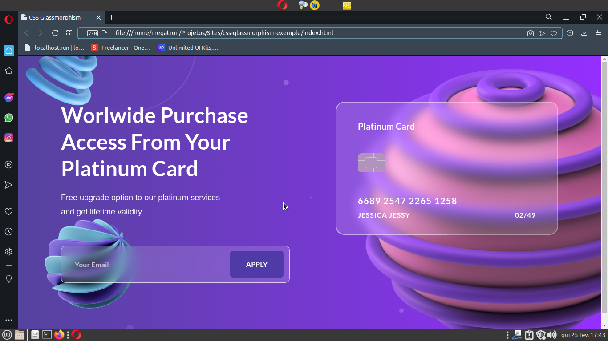

# CSS Glassmorphism

Este projeto é um exemplo de glassmorphism, uma técnica de design que simula o efeito de “vidro” feito através de CSS puro.
 Este design é inspirado no projeto [RH Agency](https://dribbble.com/rhagency), que é disponibilizado como inspiração para designers e pode ser encontrado [neste link](https://dribbble.com/shots/14778687-Glassmorphism-Header-Concept). Portanto todos os direitos sob este projeto são de posse da RH Agency, e disponibilizo esta reprodução do mesmo em meu repositório como exemplo de meus conhecimentos em CSS. Este projeto não pode ser usado para fins lucrativos, e caso você faça o download deste projeto, deve  dar os devidos créditos a RH Agency.

### Imagem ilustrativa

Caso tenha interesse em reproduzi-lo com o propósito de estudo, através [deste link](https://www.uplabs.com/posts/glassmorphism-header-concept) você pode fazer o download deste projeto no formato .fig, podendo importa-lo no [Figma](https://www.figma.com/) e conferir detalhadamente as propriedades usadas nele.

